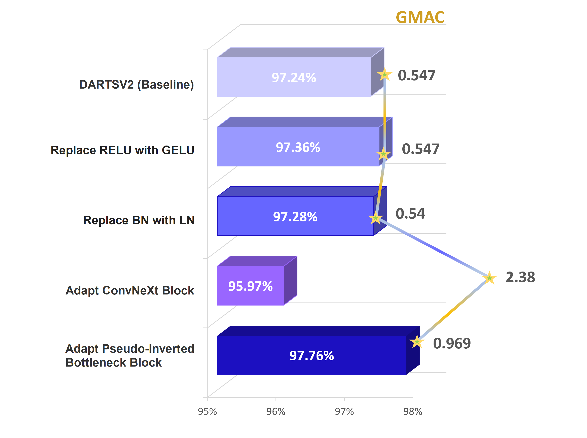
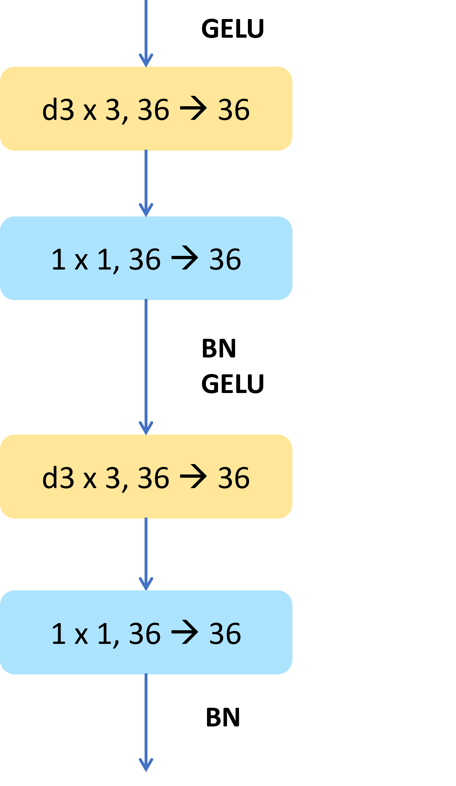
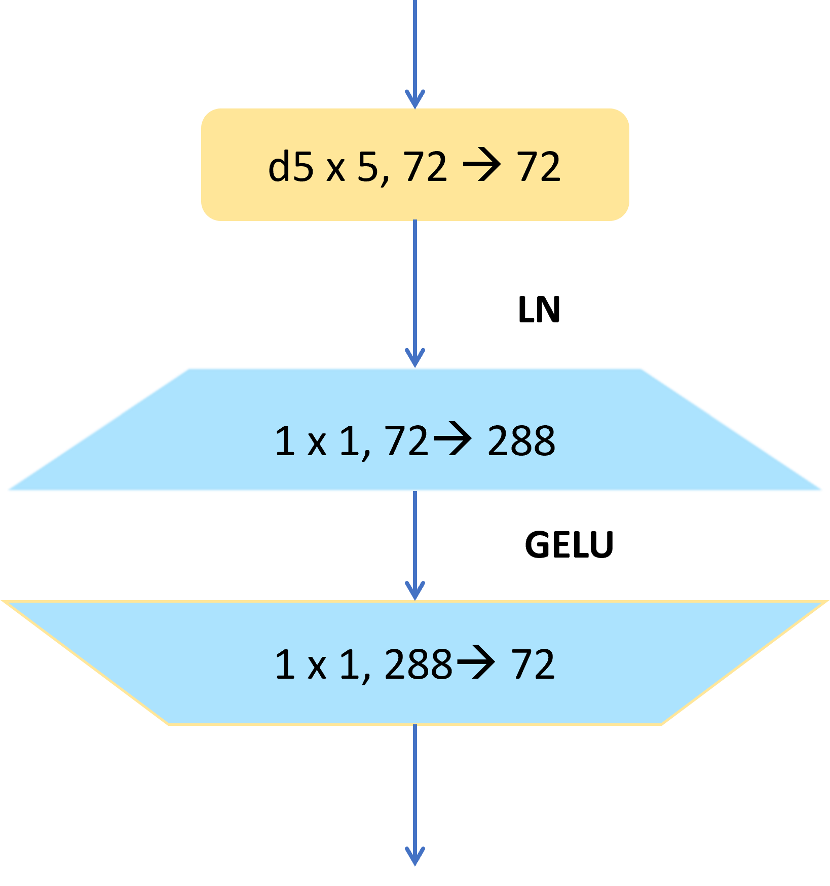
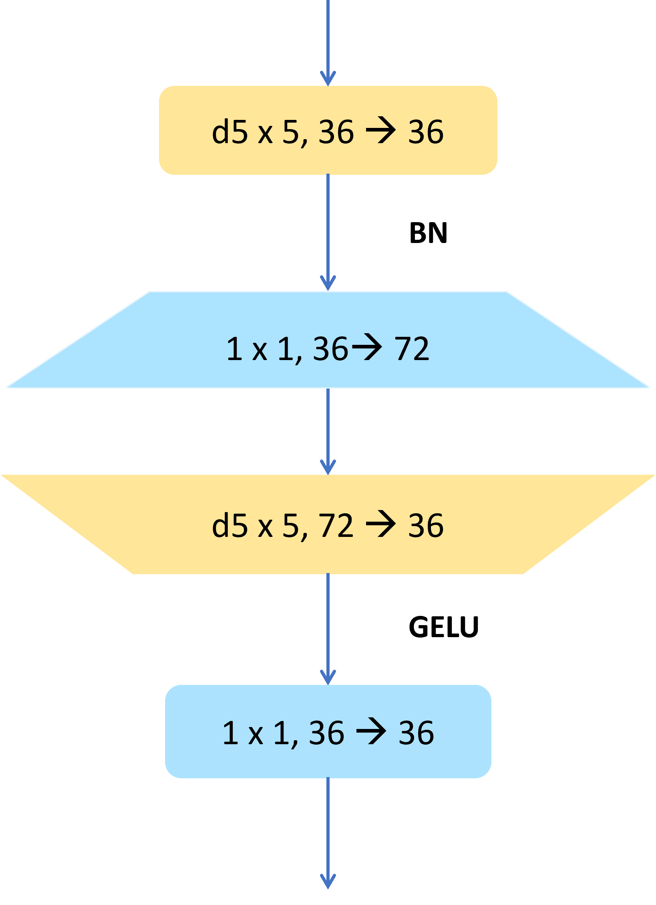
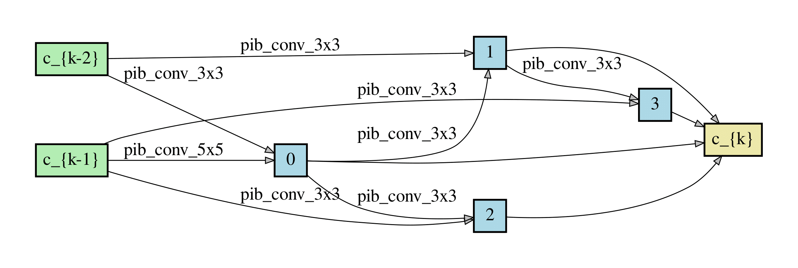
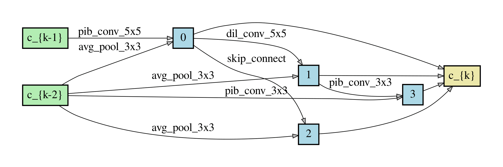
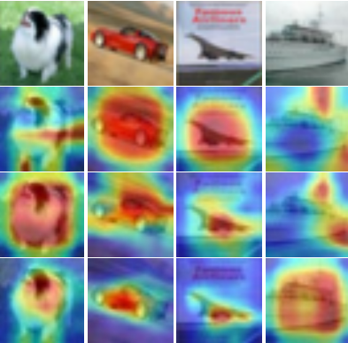

## PIBConv: Pseudo-Inverted Bottleneck Convolution for DARTS Search Space

> A. Ahmadian*, L. S. P. Liu*, Y. Fei, K. N. Plataniotis, and M. S. Hosseini, ‘Pseudo-Inverted Bottleneck Convolution for DARTS Search Space’. Accepted in ICASSP2023. 

Checkout our arXiv preprint [Paper](https://arxiv.org/abs/2301.01286)

## Highlights
**[C1.]** We present an ***incremental experiment procedure*** depicted in Fig.1 to
evaluate how design components from `ConvNeXt` impact the
performance of `DARTS` by redesigning its search space.

**[C2.]** We introduce a ***Pseudo-Inverted Bottleneck block*** shown in Fig 2 (c) to
implement an inverted bottleneck structure while minimizing
model footprint and computations. This outperforms vanilla
`DARTSV2` with *lower number of layers*, *parameter count*, and
*GMACs*.

<div align="center">
<a align="center">
  </img>
  <br>
</a>
</div>
<div align="left">
  <em>Fig. 1: Roadmap of the incremental augmentations along with their corresponding accuracies and
methodologies.</em>
</div>

<div align="center">
</img>
</img>
</img>
<br>
</div>

<div align="left">
<em> Fig. 2: Convolution Blocks : (a) DARTS Separable Convolution Block; (b) Inverted Bottleneck ConvNeXt Convolution
Block (Cinv = C × 4); (c) Pseudo-Inverted Bottleneck Cell
</em>
</div>


## Environment Setup
- Install required modules listed in `requirements.txt`
- Install pytorch plugin for counting GMACs (num. of learning parameters) from [here](https://github.com/sovrasov/flops-counter.pytorch)
  - Run `complexity.py` to obtain flop counts for the model of interest
- Install pytorch plugin for CNN model explainability from [here](https://github.com/sovrasov/flops-counter.pytorch)
  - Run "apply_gradcam.py" on desired CIFAR-10 image (no upsampling needed).

## Methodology
- Adaptation made towards convolutional block:
  - Replace ReLU with GeLU
  - Replacing BatchNorm with LayerNorm
  - Adapting the ConvNeXt Block: 
    1) Reducing num. of activation and normalization layers
    2) Adapting to an inverted bottleneck structure
    3) Moving up the depthwise separable conv. layer to facilitate training with large kernel size
 - Best accuracy-GMAC trade-off:
    - Given the equations in the Table 1, we choose ***F=2***. 
      Our Pseudo-Inverted Bottleneck block has approximately ***0.63 times*** the number of weights as the ConvNeXt block


Metrics | ConvNeXt | Pseudo-Inverted Bottleneck 
:--------- | :----------: | :-------: 
Num. of Weights per Block | $2F C^2 + K^2C$ | $(F + 1)C^2 + 2K^2C$


Define:
- $C$ = input/output channel size
- $C_{inv}$ = inverted bottleneck channel size
- $F$ = $C_{inv} / C$ inverted bottleneck ratio for the first point-wise convolution


## Experiments
### Phase I -- Searching
To arrive at the operation set we obtained after the roadmap described earlier, simply run with default ***SGD optimizer***
``` 
cd cnn &&
python train_search_adas.py \
--dataset cifar10 --image_size 32 \
--learning_rate 0.0025 \
--batch_size 32 \
--epochs 50 \
--layers 8 --node 4 \
--unrolled
```
Then, our proposed genotype is shown in Fig 3.:

<div align="center">
<a align="center">
</img>
</img>
<br>
<em> Fig. 3:  Proposed Genotype: (a) Normal cell; (b) Reduction cell</em>
</a>
</div>
    
### Phase II -- Evaluation
To evaluate our final genotype at multiple eval. layers, run the command below with desired layer count.
```
cd cnn &&
python train_cifar.py \
--arch DARTS_PseudoInvBn \
--batch_size 96 --epoch 600 --layer 20 \
--auxiliary --cutout
```

## Performance Result
**1. Evaluation Layer vs Test Accuracy / GMACs**
   Our proposed genotype’s performance is much less sensitive to evaluation layer count compared to that of DARTSV2. It achieves a higher accuracy at a lower GMAC/ parameter count with 10 evaluation layers compared to DARTSV2 evaluated at 20 layers.


| Genotype     | Eval. Layers | Test Acc. (%)  | Params (M) | GMAC  |
|--------------|--------------|----------------|------------|-------|
| DARTSV2      | 20           | 97.24          | 3.30       | 0.547 |
|              | 10           | 96.72          | 1.6        | 0.265 |
| Our Genotype | 10           | 97.29          | 3.02       | 0.470 |
|              | 5            | 96.65          | 1.30       | 0.218 |


**2. GradCAM visualization**
To visualize the featured learned by our model, we perform a GradCAM visualization on our
genotype and compare it with that of DARTSV2

<div align="center">
<a align="center">
</img>
<br>
  </a>
  </div>
 <div align="left">
<em> Fig.4: GradCAM: The first row shows the 32 × 32 input images with labels: dog, automobile, airplane, ship; The second
row shows DARTSV2 evaluated on 20 layers; Then third and
fourth rows show our genotype evaluated on {10, 20} layers, respectively. (Note: All of the images are up-sampled to
224 × 224 for better readability)</em>
</div>


